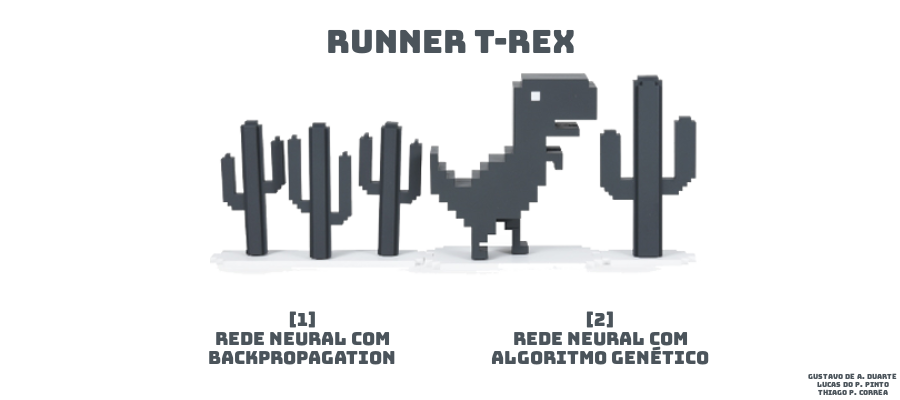

# Super Runner T-Rex
> Projeto para a disciplina de Inteligência Artificial (IA).

O projeto engloba a recriação do jogo na linguagem _Python_, e a criação de uma IA para aprender a joga-lo, sendo que esta IA foi desenvolvida utilizando dois métodos (Redes Neurais Artificiais com _Backpropagation_ e Redes Neurais Artificiais com Algoritmo Genético).



## Instalação

Para a utilização da aplicação, serão necessários alguns componentes, como a linguagem _Python_, o gerenciador de pacotes _Pip_ e as bibliotecas _Pygame_ e _NumPy_.

#### OS X & Linux:

Python 3.7
```sh
sudo apt-get install python3.7
```

Pip 3
```sh
sudo apt-get -y install python3-pip
```

Pygame
```sh
sudo pip install pygame
```

NumPy
```sh
sudo pip install numpy
```

#### Windows:

Python 3.7
```sh
https://www.python.org/ftp/python/3.7.5/python-3.7.5-amd64.exe
```

Pip 3 (Já instalado)

Pygame
```sh
pip install pygame
```

NumPy
```sh
pip install numpy
```

## Exemplo de uso

Para executar, basta acessar a pasta _Scripts_ e executar o arquivo _Game.py_. Ou por linha de código:

#### OS X & Linux:
```sh
python3 Game.py
```

#### Windows:
```sh
python Game.py
```

## Meta

Gustavo de Almeida Duarte – [@gustavodealmeida](https://github.com/gustavodealmeida/) – gduarte@alunos.utfpr.edu.br

Lucas do Prado Pinto – [@pradoplucas](https://github.com/pradoplucas/) – lucaspinto@alunos.utfpr.edu.br

Thiago Pereira Correa – [@ThiagoPokst](https://github.com/ThiagoPokst/) – thiagocorrea@alunos.utfpr.edu.br 

## Contributing

1. Faça o _fork_ do projeto (<https://github.com/pradoplucas/projectIA>)
2. Crie uma _branch_ para sua modificação (`git checkout -b feature/fooBar`)
3. Faça o _commit_ (`git commit -am 'Add some fooBar'`)
4. _Push_ (`git push origin feature/fooBar`)
5. Crie um novo _Pull Request_
